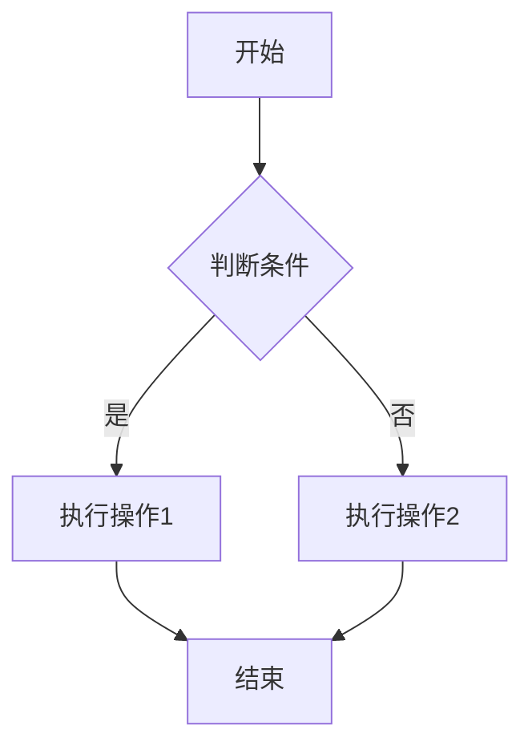
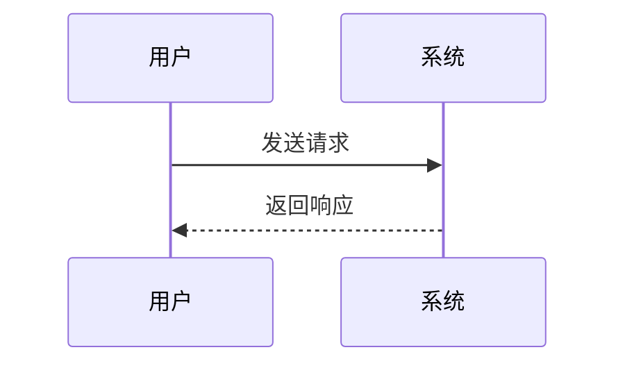
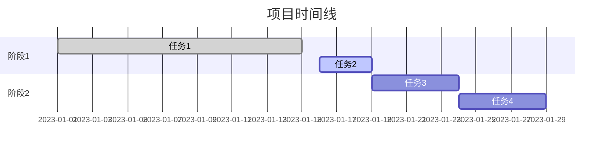
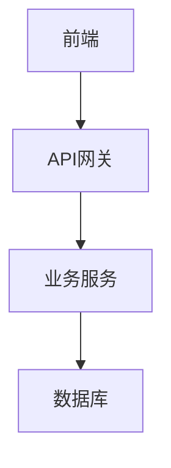

# Markdown语法总结

## 概述

Markdown是一种轻量级标记语言，使用简洁的语法来格式化文本。本文档总结了Markdown的核心语法和扩展功能。

## 标题

```markdown
# 一级标题
## 二级标题
### 三级标题
#### 四级标题
##### 五级标题
###### 六级标题
```

### 自定义锚点

```markdown
# 标题 {#custom-id}
## 另一个标题 {#another-id}
```

## 文本格式

### 基础格式

```markdown
**粗体文本**
*斜体文本*
***粗斜体文本***
~~删除线文本~~
`行内代码`
```

### 下划线和上标下标

```markdown
<u>下划线文本</u>
H<sub>2</sub>O (下标)
X<sup>2</sup> (上标)
```

### 高亮文本

```markdown
==高亮文本==
```

## 段落和换行

```markdown
这是第一段文本。

这是第二段文本。

这是同一段的第一行。  
这是同一段的第二行（行末两个空格实现换行）。
```

## 列表

### 无序列表

```markdown
- 项目1
- 项目2
  - 子项目2.1
  - 子项目2.2
    - 子子项目2.2.1
- 项目3

* 也可以使用星号
+ 或者加号
```

### 有序列表

```markdown
1. 第一项
2. 第二项
   1. 子项目2.1
   2. 子项目2.2
3. 第三项

<!-- 数字可以不按顺序 -->
1. 第一项
3. 第二项（显示为2）
5. 第三项（显示为3）
```

### 任务列表

```markdown
- [x] 已完成任务
- [ ] 未完成任务
- [x] ~~已完成并删除的任务~~
```

## 链接

### 基础链接

```markdown
[链接文本](https://example.com)
[链接文本](https://example.com "鼠标悬停提示")
<https://example.com>
<email@example.com>
```

### 参考式链接

```markdown
[链接文本][1]
[另一个链接][link-ref]

[1]: https://example.com
[link-ref]: https://example.com "可选标题"
```

### 内部链接

```markdown
[跳转到标题](#标题名称)
[相对路径](./other-file.md)
[绝对路径](/path/to/file.md)
```

## 图片

### 基础图片

```markdown


```

### 参考式图片

```markdown
![替代文本][image-ref]

[image-ref]: image.jpg "图片标题"
```

### 图片链接

```markdown
[](https://example.com)
```

### HTML图片标签

```markdown


```

## 代码

### 行内代码

```markdown
这是 `行内代码` 示例。
使用 `console.log()` 输出信息。
```

### 代码块

````markdown
```
普通代码块
无语法高亮
```

```javascript
// JavaScript代码块
function hello() {
    console.log("Hello, World!");
}
```

```python
# Python代码块
def hello():
    print("Hello, World!")
```

```css
/* CSS代码块 */
.example {
    color: #333;
    font-size: 16px;
}
```
````

### 代码块高级功能

````markdown
```javascript{1,3-5}
const a = 1; // 高亮行
const b = 2;
const c = 3; // 高亮行
const d = 4; // 高亮行
const e = 5; // 高亮行
```

```javascript
function example() {
    console.log('focus line'); // [!code focus]
    console.log('normal line');
    console.log('highlight line'); // [!code highlight]
}
```
````

## 表格

### 基础表格

```markdown
| 左对齐 | 居中对齐 | 右对齐 |
| :--- | :---: | ---: |
| 内容1 | 内容2 | 内容3 |
| 长内容 | 短内容 | 中等内容 |
```

### 复杂表格

```markdown
| 功能 | 支持 | 备注 |
|------|------|------|
| **粗体** | ✅ | 支持 |
| *斜体* | ✅ | 支持 |
| `代码` | ✅ | 支持 |
| [链接](/) | ✅ | 支持 |
```

## 引用

### 基础引用

```markdown
> 这是一个引用。
> 
> 这是引用的第二段。

> 这是第一层引用
>> 这是嵌套引用
>>> 这是三层嵌套引用
```

### 引用中的其他元素

```markdown
> ## 引用中的标题
> 
> - 引用中的列表项1
> - 引用中的列表项2
> 
> ```javascript
> // 引用中的代码块
> console.log("Hello");
> ```
```

## 分隔线

```markdown
---
***
___
```

## HTML标签

### 常用HTML标签

```markdown
<kbd>Ctrl</kbd> + <kbd>C</kbd>
<mark>高亮文本</mark>
<small>小字体文本</small>
<details>
<summary>点击展开</summary>
这里是详细内容
</details>
```

### 居中对齐

```markdown
<div align="center">
居中的内容
</div>

<p align="center">

</p>
```

## 数学公式

### 行内公式

```markdown
这是行内公式 $E = mc^2$
质量能量方程 $E = mc^2$
```

### 块级公式

```markdown
$$
\frac{1}{2} \times \frac{3}{4} = \frac{3}{8}
$$

$$
\sum_{i=1}^{n} x_i = x_1 + x_2 + \cdots + x_n
$$
```

## 脚注

```markdown
这是一个脚注示例[^1]。
这是另一个脚注[^note]。

[^1]: 这是脚注的内容。
[^note]: 这是命名脚注的内容。
```

## 定义列表

```markdown
术语1
: 定义1

术语2
: 定义2a
: 定义2b
```

## 缩写

```markdown
*[HTML]: HyperText Markup Language
*[CSS]: Cascading Style Sheets

HTML和CSS是网页开发的基础技术。
```

## 转义字符

```markdown
\* 不是斜体
\# 不是标题
\[ 不是链接
\` 不是代码

使用反斜杠 \\ 显示反斜杠
```

## 特殊字符

```markdown
&copy; 版权符号
&reg; 注册商标
&trade; 商标
&nbsp; 不间断空格
&lt; 小于号
&gt; 大于号
&amp; 和号
```

## 表情符号

```markdown
:smile: :heart: :thumbsup:
:warning: :information_source: :bulb:
:rocket: :fire: :star:
```

## 高级技巧

### 嵌套列表与代码

```markdown
1. 第一步
   ```bash
   npm install
   ```

2. 第二步
   - 子步骤1
     ```javascript
     console.log("Hello");
     ```
   - 子步骤2
```

### 表格中的复杂内容

```markdown
| 项目 | 描述 | 示例 |
|------|------|------|
| 代码 | 行内代码 | `console.log()` |
| 链接 | 外部链接 | [Google](https://google.com) |
| 列表 | 简单列表 | • 项目1<br>• 项目2 |
```

### 混合内容块

```markdown
> **注意**: 这是一个重要提示
> 
> ```javascript
> // 示例代码
> function important() {
>     return "重要功能";
> }
> ```
> 
> 更多信息请参考 [官方文档](https://example.com)
```

## 最佳实践

### 文档结构

```markdown
# 文档标题

## 概述
简要介绍文档内容

## 目录
- [章节1](#章节1)
- [章节2](#章节2)

## 章节1
详细内容...

## 章节2
详细内容...

## 总结
总结要点
```

### 代码文档

```markdown
## API参考

### `functionName(param1, param2)`

**参数:**
- `param1` (string): 参数描述
- `param2` (number): 参数描述

**返回值:**
- (boolean): 返回值描述

**示例:**
```javascript
const result = functionName("hello", 42);
console.log(result); // true
```
```

### 图片最佳实践

```markdown
<!-- 响应式图片 -->


<!-- 带说明的图片 -->

*图1: 主界面功能截图*
```

## 常见问题

### 换行问题
- 段落间需要空行
- 行内换行需要行末两个空格
- 或使用HTML的`<br>`标签

### 特殊字符
- 使用反斜杠转义特殊字符
- HTML实体字符用于特殊符号
- 注意中英文标点符号的区别

### 兼容性
- 不同Markdown解析器可能有差异
- 扩展语法不是所有平台都支持
- 建议使用标准Markdown语法确保兼容性

## 扩展语法

### Mermaid图表

````markdown



````

### 流程图

````markdown
```flow
st=>start: 开始
op=>operation: 处理数据
cond=>condition: 判断条件
e=>end: 结束

st->op->cond
cond(yes)->e
cond(no)->op
```
````

### 甘特图

````markdown

````

### 键盘按键

```markdown
按 <kbd>Ctrl</kbd> + <kbd>C</kbd> 复制
按 <kbd>Ctrl</kbd> + <kbd>V</kbd> 粘贴
按 <kbd>Alt</kbd> + <kbd>Tab</kbd> 切换窗口
```

### 进度条

```markdown
<progress value="70" max="100">70%</progress>

**项目进度**: 70% 完成
```

### 颜色标记

```markdown
<span style="color: red;">红色文本</span>
<span style="color: #007acc;">蓝色文本</span>
<span style="background-color: yellow;">黄色背景</span>
```

### 音频和视频

```markdown
<audio controls>
  <source src="audio.mp3" type="audio/mpeg">
  您的浏览器不支持音频元素。
</audio>

<video width="320" height="240" controls>
  <source src="video.mp4" type="video/mp4">
  您的浏览器不支持视频标签。
</video>
```

## 文档模板

### README模板

```markdown
# 项目名称

简短的项目描述

## 功能特性

- 功能1
- 功能2
- 功能3

## 安装

```bash
npm install project-name
```

## 使用方法

```javascript
import { feature } from 'project-name'

feature.doSomething()
```

## API文档

### `methodName(param)`

描述方法的功能

**参数:**
- `param` (type): 参数描述

**返回值:**
- (type): 返回值描述

## 贡献指南

1. Fork 项目
2. 创建功能分支
3. 提交更改
4. 推送到分支
5. 创建 Pull Request

## 许可证

MIT License
```

### 更新日志模板

```markdown
# 更新日志

## [1.2.0] - 2023-12-01

### 新增
- 添加了新功能A
- 添加了新功能B

### 修改
- 改进了性能
- 更新了文档

### 修复
- 修复了bug #123
- 修复了兼容性问题

### 移除
- 移除了废弃的API

## [1.1.0] - 2023-11-01

### 新增
- 初始版本发布
```

### 技术文档模板

```markdown
# 技术规范文档

## 概述

简要描述技术规范的目的和范围

## 架构设计

### 系统架构



### 技术栈

| 层级 | 技术 | 版本 |
|------|------|------|
| 前端 | Vue.js | 3.x |
| 后端 | Node.js | 18.x |
| 数据库 | MongoDB | 6.x |

## 接口规范

### 请求格式

```json
{
  "method": "POST",
  "url": "/api/users",
  "headers": {
    "Content-Type": "application/json"
  },
  "body": {
    "name": "用户名",
    "email": "email@example.com"
  }
}
```

### 响应格式

```json
{
  "code": 200,
  "message": "success",
  "data": {
    "id": 1,
    "name": "用户名",
    "email": "email@example.com"
  }
}
```

## 部署指南

### 环境要求

- Node.js >= 18.0
- MongoDB >= 6.0
- Redis >= 7.0

### 部署步骤

1. 克隆代码
   ```bash
   git clone https://github.com/username/project.git
   ```

2. 安装依赖
   ```bash
   npm install
   ```

3. 配置环境变量
   ```bash
   cp .env.example .env
   ```

4. 启动服务
   ```bash
   npm start
   ```
```

## 工具和资源

### 在线编辑器
- [Typora](https://typora.io/) - 所见即所得编辑器
- [Mark Text](https://marktext.app/) - 实时预览编辑器
- [Dillinger](https://dillinger.io/) - 在线Markdown编辑器

### 转换工具
- [Pandoc](https://pandoc.org/) - 文档格式转换
- [Markdown to PDF](https://www.markdowntopdf.com/) - 在线转换
- [GitBook](https://www.gitbook.com/) - 文档发布平台

### 语法检查
- [markdownlint](https://github.com/DavidAnson/markdownlint) - 语法检查工具
- [Grammarly](https://www.grammarly.com/) - 语法和拼写检查
- [Alex](https://alexjs.com/) - 包容性语言检查
